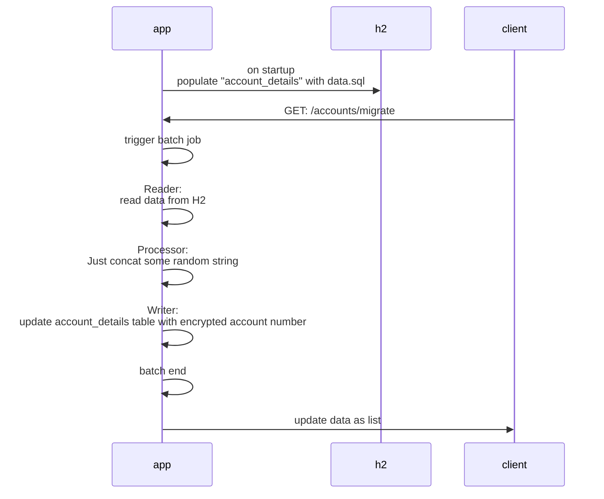

### Flow
1. Load data into Postgres (table: account_details) from data.sql on startup. `GET: /accounts` - done
2. Trigger the batch from api: `GET: /accounts/migrate` - done

```mermaid
sequenceDiagram

app ->> h2: on startup <br> populate "account_details" with data.sql
client ->> app: GET: /accounts/migrate
app ->> app: trigger batch job
app ->> app: Reader: <br> read data from H2
app ->> app: Processor: <br> Just concat some random string
app ->> app: Writer: <br> update account_details table with encrypted account number
app ->> app: batch end
app ->> client: update data as list
```

