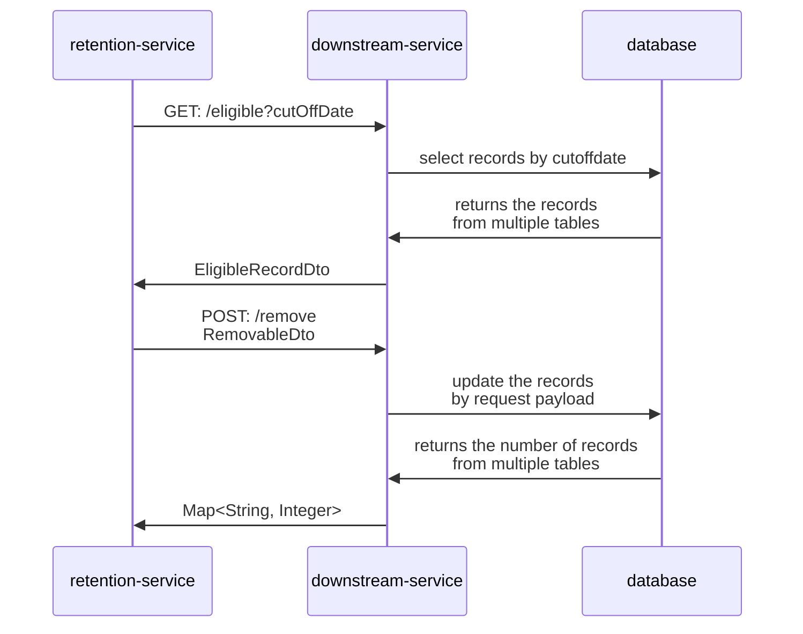
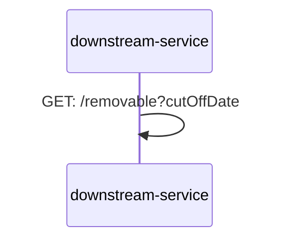

Retention service
-
Two ways to trigger the process
1. Endpoint `/trigger`
2. Scheduler

Process calls endpoint 

Downstream service
-

Deletion of records
Two ways to trigger the process
1. Endpoint `/trigger`
2. Scheduler

