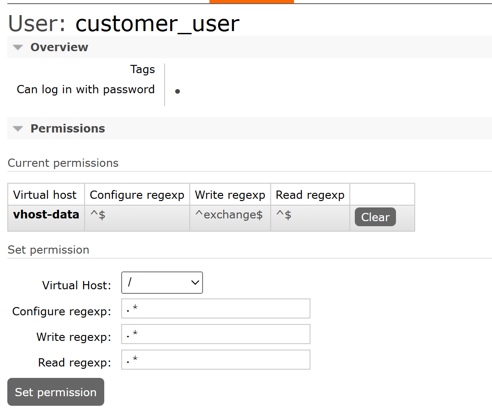
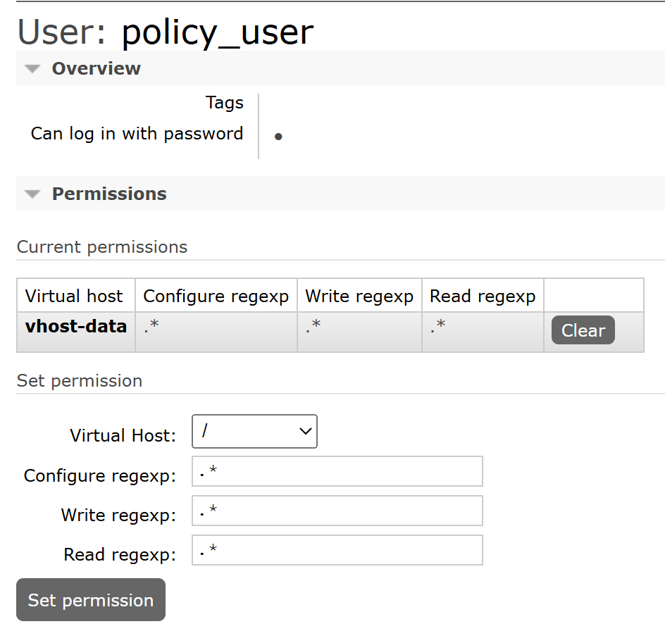
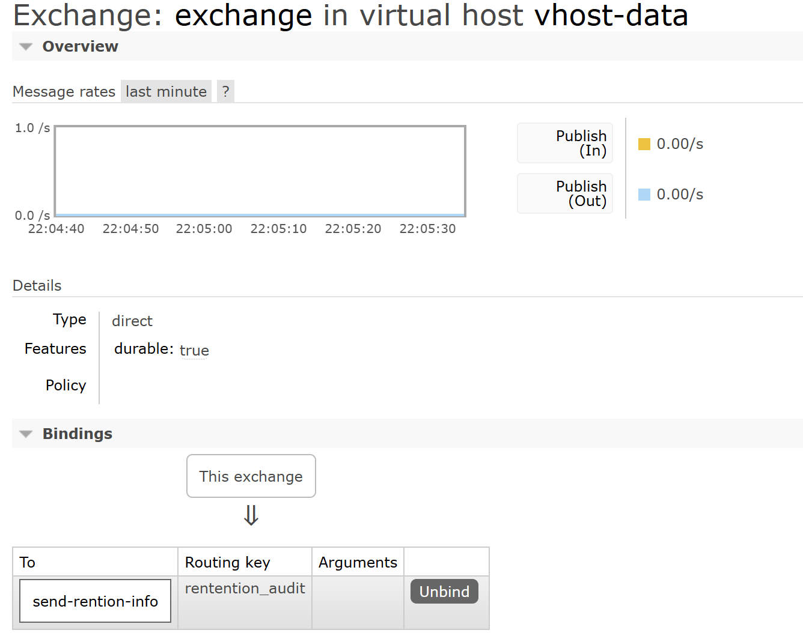

```bash
    docker run -d --name rabbitmq -p 5672:5672 -p 15672:15672 rabbitmq:3-management
```


policy-service: 8091
--
/start --> send msg to
user=policy_user | vhost=vhost-data | ex=exchange | routing key=rentention_audit | queue=send-retion-info

customer-service: 8090
--
/start --> send msg to
user=customer_user | vhost=vhost-data | ex=exchange | routing key=rentention_audit | queue=send-rention-info


gdpr-service: 8080
--
listner -> reads from | queue=send-rention-info


Customer user creation:
--
This user just has access to publish messages on exchange name: exchange within the vhost: vhost-data.
vhost-data   ^$	 ^exchange$	 ^$



Policy user creation:
--
This user has access to everything within the vhost: vhost-data. like exchange/queue creation and binding.
vhost-data   .* .*  .*


Exchange creation & binding
--
